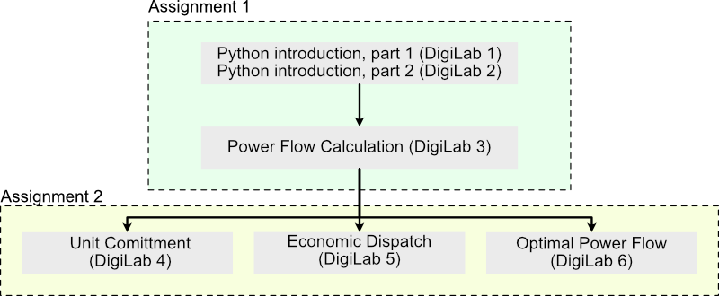

# DigiLab Notebooks

There will be in total of six Jupyter Notebooks presented and walked through in this course with corresponding assignments.

1. **Python Fundamentals, Part 1**: Introduction to basic Python syntax and programming concepts.
2. **Python Fundamentals, Part 2**: Continued exploration of Python programming techniques.
3. **Power Flow Calculations**: A showcase of how the power flow problem can be solved in Python.
4. **Unit Commitment**: Using the Python library PyPSA to solve the unit commitment problem.
5. **Economic Dispatch**: Using the Python library PyPSA to solve the economic dispatch problem.
6. **Optimal Power Flow**: An introduction to optimal power flow (OPF).

## Required set up

1. Open up [Google Colab](https://colab.research.google.com/github/) and enter the URL form this page: [EPE2316-Power-System-Planning](https://github.com/sambeets/EPE2316-Power-System-Planning)
2. Navigate  to the desired DigiLab notebook file (.ipynb) and click on it to open it up.
3. Run the first cell to copy the Power System Planning github repo, and to install the necessary modules for the notebook.
4. You are now ready to use Google Colab for power system simulations in Python.
